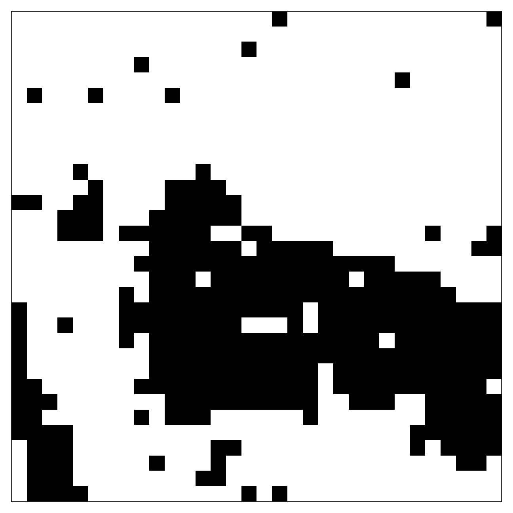

# Ising Model/Metropolis Algorithm Simulator

A basic Ising model/Metropolis algorithm simulator built in Python.
The core computations are reliant on numba JIT compiled functions which reduce the runtime by two orders of magnitude.

## Basic Usage
```python
# Import the simulation class
from ising import Ising


config = {
    "L": 32, # lattice side length
    "β": np.log(1 + np.sqrt(2)) / 2, # inverse temperature
    "d": 2, # dimensionality of the lattice, must be ∈ {1, 2}
    "seed": 8, # rng seed
    "n_sweeps": 100000, # number of Monte Carlo update sweeps to perform
    "thermalization_cutoff": 0.2, # ratio of observations to exclude due to thermalization
    "start_type": "hot", # how the spins are initialized ("cold" aligned, "hot", random)
    "save_path": "/tmp/ising/data" # where to save the data and images
}

I = Ising(config)
I.metropolis()
print(I.observables)
I.plot_lattice(save_as="lattice_32.png")
```

Output:
```
{'e': -1.4350305908203125,
 'e_sq': 2.0686405833244326,
 'c': 1.8549774574906535,
 'm': 0.6591650634765625,
 'm_sq': 0.46419199652671816,
 'χ': 13.399548024155266,
 'β': 0.44068679350977147,
 'N_samples': 80000,
 'L': 32}
```


